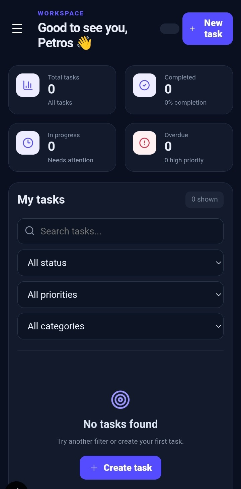
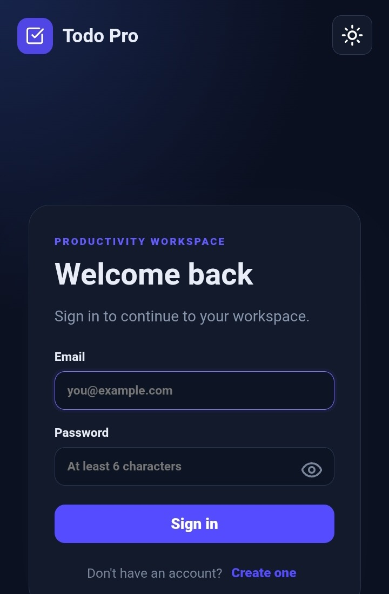
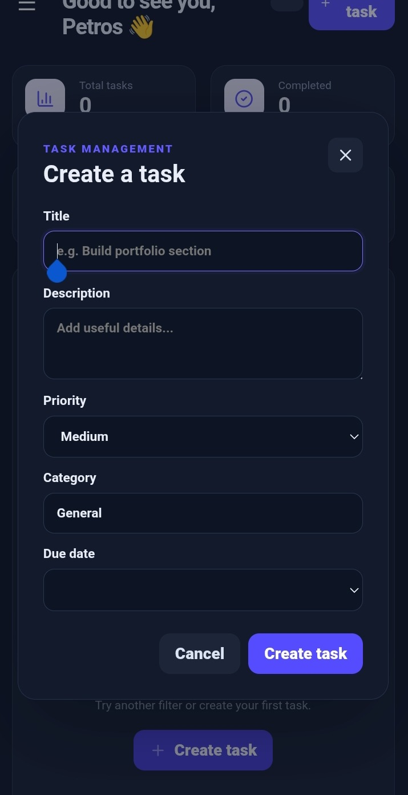
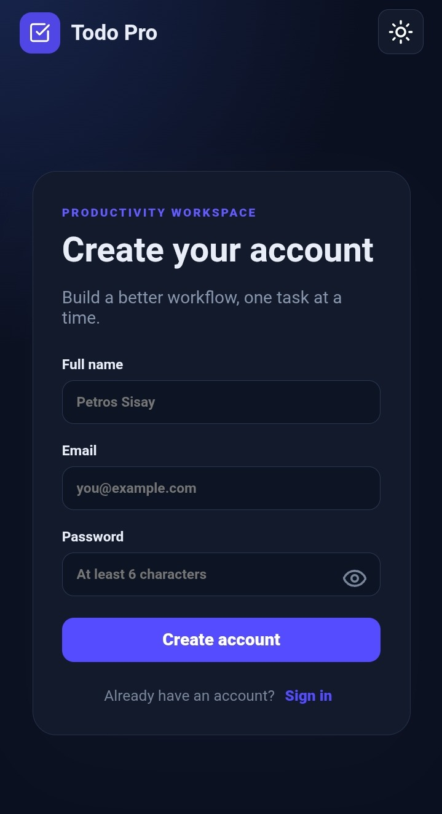
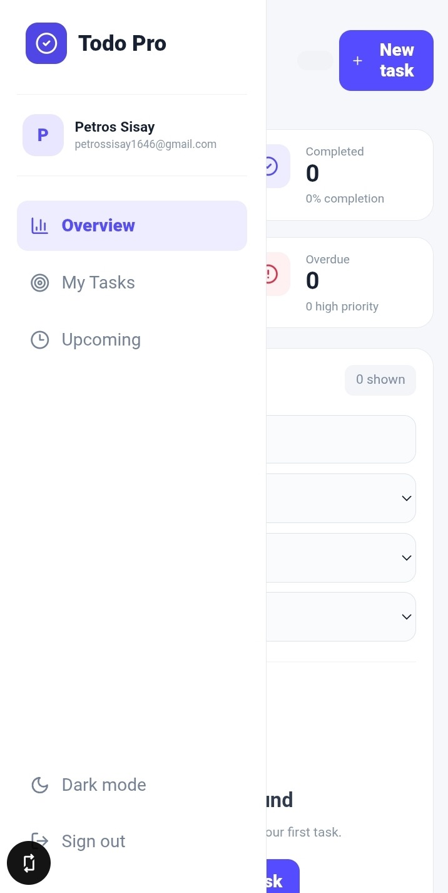

# 🚀 MERN Todo Pro

A modern, full-stack Todo Management application built with the **MERN Stack**.

MERN Todo Pro goes beyond a basic Todo List by providing JWT authentication, dashboard statistics, priorities, categories, due dates, search, dark mode, reminders, and a responsive modern interface.

---

## 🌐 Live Demo

### Frontend
🔗 https://mern-todo-pro.vercel.app

### Backend API
🔗 https://mern-todo-pro-api.onrender.com

---

## 📸 Screenshots

### 📊 Dashboard — Mobile


### 🔐 Login


### 📝 Create Task


### 👤 Register


### ☀️ Light Mode & Navigation


---
## ✨ Features

- 🔐 JWT Authentication
- 📝 User Registration & Login
- 🔒 Protected Routes
- 📊 Dashboard Statistics
- ✅ Create, Update & Delete Tasks
- ✔️ Mark Tasks as Completed
- 🎯 Task Priorities
- 📅 Due Dates
- 🏷️ Task Categories
- 🔍 Search Tasks
- 📌 Task Status Management
- 🌙 Dark Mode
- 🔔 Task Reminders
- 🔊 5-Minute Reminder Notification
- 📱 Responsive Design
- ⚡ React + Vite
- ☁️ MongoDB Atlas
- 🚀 Render Backend
- ▲ Vercel Frontend

---

## 🛠️ Tech Stack

### Frontend

- React
- Vite
- React Router
- Axios
- CSS
- React Icons
- Context API

### Backend

- Node.js
- Express.js
- MongoDB
- Mongoose
- JWT
- bcrypt
- dotenv
- CORS
- Helmet
- Morgan

### Deployment

- GitHub
- MongoDB Atlas
- Render
- Vercel

---

## 🌐 Production Architecture

```text
                    🌍 USER
                       │
                       ▼
              ┌─────────────────┐
              │     VERCEL      │
              │                 │
              │ React + Vite    │
              │ Todo Frontend   │
              └────────┬────────┘
                       │
                       │ HTTPS API
                       ▼
              ┌─────────────────┐
              │     RENDER      │
              │                 │
              │ Node.js         │
              │ Express.js      │
              │ JWT API         │
              └────────┬────────┘
                       │
                       ▼
              ┌─────────────────┐
              │ MONGODB ATLAS   │
              │                 │
              │ Users + Todos   │
              └─────────────────┘
